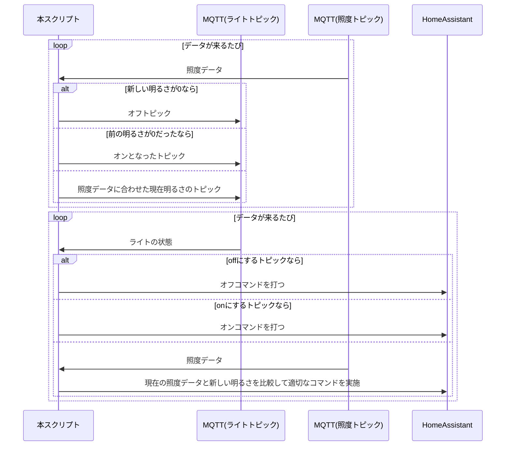

# virtual_light_entity_for_IR
赤外線稼働の普通のシーリングライトなどをスマート化する仮想ライトエンティティを作るソリューション

## 必要な物
- HomeAssistantで使用可能なIR送信機
(Broadlink Rm4Cなど)
- シーリングライトに取り付けた明るさセンサ
(MQTTで明るさトピックを送信する物)
- MQTTサーバ
- 環境が違うなら改造する努力

### 参考 - 作者の環境
- HomeAssistant
- MQTTサーバ(mosquito)
- 明るさセンサ(ESPHome + BH1750) MQTTトピック設定済み
- BroadLink RM4c(各コマンドをスクリプトとしてHAに設定。)

## Usage
事前にHomeAssistantにMQTTライトエンティティの設定を行う。[参考 - MQTTLight HomeAssistant](https://www.home-assistant.io/integrations/light.mqtt)
```yaml
# Example configuration.yaml entry
mqtt:
  - light:
      name: mqtt_json_light_1
      schema: json
      supported_color_modes: ["brightness"]
      brightness: true
      brightness_scale: 5 # 今回は5段階
      command_topic: "homeassistant/light/<device-id>/set"
      state_topic: "homeassistant/light/<device-id>/state"
```

dockerを使うとラク。
```sh
cp settings.sample.json settings.json
docker build --no-cache
docker compose up -d
```
## 構造図

