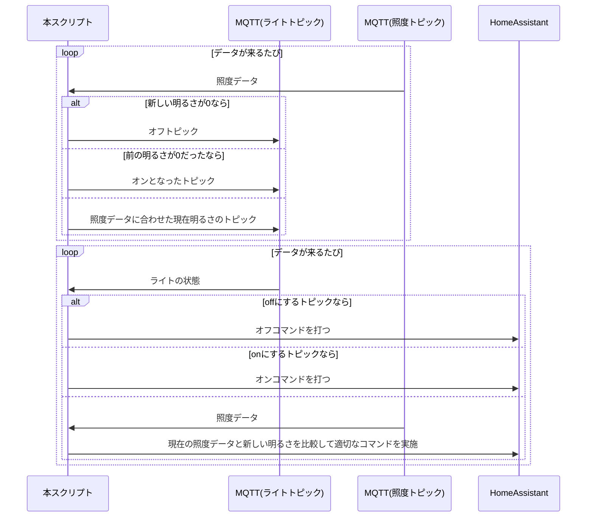

# virtual_light_entity_for_IR
赤外線稼働の普通のシーリングライトなどをスマート化する仮想ライトエンティティを作るソリューション


## Usage
```
docker pull
docker compose up -d
```



```mermaid
sequenceDiagram
    participant python as 本スクリプト
    participant light as MQTT(ライトトピック) 
    participant bright as MQTT(照度トピック)
    participant HA as HomeAssistant


    loop データが来るたび
        bright ->> python : 照度データ
        alt 新しい明るさが0なら
            python ->> light : オフトピック
        else 前の明るさが0だったなら
            python ->> light : オンとなったトピック
        else
            python ->> light : 照度データに合わせた現在明るさのトピック
        end
    end

    loop データが来るたび
        light ->> python : ライトの状態
        alt offにするトピックなら
            python ->> HA : オフコマンドを打つ
        else onにするトピックなら
            python ->> HA : オンコマンドを打つ
        else
            bright ->> python : 照度データ
            python ->> HA : 現在の照度データと新しい明るさを比較して適切なコマンドを実施
        end
    end 
    

```